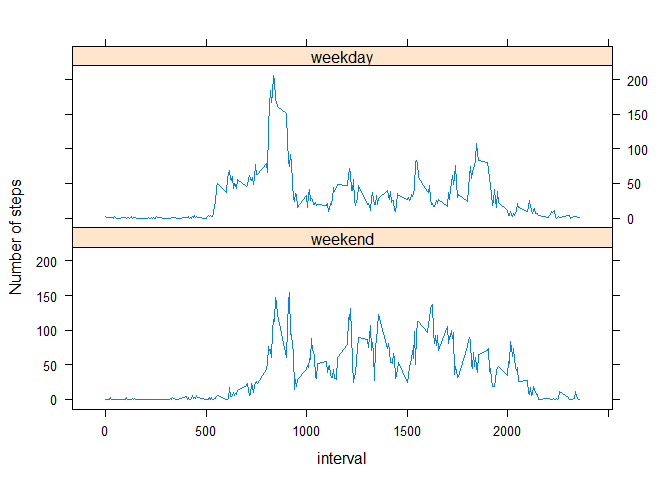

# Reproducible Research: Peer Assessment 1


## Loading and preprocessing the data

Let us first make sure that the data file is in the working directory;
if not, let us unzip it and then load it


```r
dataFileName <- "activity.csv"
zipFileName <- "activity.zip"

if (!file.exists(dataFileName))
  unzip(zipFileName)

dataset <- read.csv(dataFileName, 
                    stringsAsFactors = FALSE,
                    colClasses = c("integer", "Date", "integer"))
```

Now we can examine the dataset in more detail:


```r
str(dataset)
```

```
## 'data.frame':	17568 obs. of  3 variables:
##  $ steps   : int  NA NA NA NA NA NA NA NA NA NA ...
##  $ date    : Date, format: "2012-10-01" "2012-10-01" ...
##  $ interval: int  0 5 10 15 20 25 30 35 40 45 ...
```


```r
names(dataset)
```

```
## [1] "steps"    "date"     "interval"
```


```r
head(dataset)
```

```
##   steps       date interval
## 1    NA 2012-10-01        0
## 2    NA 2012-10-01        5
## 3    NA 2012-10-01       10
## 4    NA 2012-10-01       15
## 5    NA 2012-10-01       20
## 6    NA 2012-10-01       25
```


```r
tail(dataset)
```

```
##       steps       date interval
## 17563    NA 2012-11-30     2330
## 17564    NA 2012-11-30     2335
## 17565    NA 2012-11-30     2340
## 17566    NA 2012-11-30     2345
## 17567    NA 2012-11-30     2350
## 17568    NA 2012-11-30     2355
```

## What is mean total number of steps taken per day?

Let us compute the total number of steps per day (ignoring missing values) using the *dplyr* package


```r
library(dplyr)
```

```
## 
## Attaching package: 'dplyr'
## 
## The following object is masked from 'package:stats':
## 
##     filter
## 
## The following objects are masked from 'package:base':
## 
##     intersect, setdiff, setequal, union
```

```r
stepsPerDay <- dataset %>% group_by(date) %>% summarise(steps_per_day = sum(steps, na.rm = TRUE))
```

Now let us plot a histogram of the total number of steps per day


```r
hist(stepsPerDay$steps_per_day, 
     main = "Histogram of the total number of daily steps (excluding missing data)",
     xlab = "Total number of daily steps",
     col = "red"
     )
```

 

Let us calculate and report the mean and median of the total number of steps taken per day


```r
meanStepsPerDay <- mean(stepsPerDay$steps_per_day)
medianStepsPerDay <- median(stepsPerDay$steps_per_day)
```

The mean total number of daily steps is **9354.2295082**  
The median total number of daily steps is **10395**

## What is the average daily activity pattern?

Let us compute the average number of steps taken per 5-minute interval across all days.


```r
avgStepsPerInterval <- dataset %>% group_by(interval) %>% summarise(avg_steps_per_interval = mean(steps, na.rm = TRUE))
```

Now let us plot the 5-minute intervals (x-axis) and the average number of steps taken, averaged across all days (y-axis)


```r
plot(avgStepsPerInterval$interval, 
     avgStepsPerInterval$avg_steps_per_interval,
     type = "l",
     main = "Average number of steps taken per 5-minute interval",
     xlab = "5-minute interval ID",
     ylab = "Average number of steps taken"
    )
```

 

Let us find out which 5-minute interval, on average across all the days in the dataset, contains the maximum (not the average) number of steps.


```r
maxStepsPerInterval <- dataset %>% group_by(interval) %>% summarise(total_steps_per_interval = sum(steps, na.rm = TRUE))
maxNrSteps <- max(maxStepsPerInterval$total_steps_per_interval)
intervalMaxStepsIdx <- which(maxStepsPerInterval$total_steps_per_interval == maxNrSteps)
```

The maximum number of steps taken across all days was **10927** and happened in the interval **835 - 840**

## Imputing missing values

Let us now deal with the missing values (NAs) in our dataset. First of all, how many incomplete cases do we have?


```r
nrow(dataset) - sum(complete.cases(dataset))
```

```
## [1] 2304
```

Let us impute the missing values in the 'steps' field by using the median of the steps in the corresponding 5-minute interval. I have chosen the median over the mean as it is more robust to outliers.  

Let us create a new dataset that is equal to the original dataset but with the missing data filled in.


```r
medianStepsPerInterval <- dataset %>% group_by(interval) %>% summarise(median_steps_per_interval = median(steps, na.rm = TRUE))
newDataset <- dataset
missingStepsLogical <- is.na(dataset$steps)
missingStepsIntervals <- dataset$interval[missingStepsLogical]
missingStepsMedianValues <- medianStepsPerInterval$median_steps_per_interval[match(missingStepsIntervals,dataset$interval)]
newDataset$steps[missingStepsLogical] <- missingStepsMedianValues
head(newDataset, 10)
```

```
##    steps       date interval
## 1      0 2012-10-01        0
## 2      0 2012-10-01        5
## 3      0 2012-10-01       10
## 4      0 2012-10-01       15
## 5      0 2012-10-01       20
## 6      0 2012-10-01       25
## 7      0 2012-10-01       30
## 8      0 2012-10-01       35
## 9      0 2012-10-01       40
## 10     0 2012-10-01       45
```

After executing the above code, are these still some NAs around in the 'newDataset' variable?


```r
any(is.na(newDataset))
```

```
## [1] FALSE
```

Good! Now we can proceed to make a histogram of the total number of steps taken each day on the new data set (with imputed missing values).


```r
stepsPerDayNewDataset <- newDataset %>% group_by(date) %>% summarise(steps_per_day = sum(steps))

hist(stepsPerDayNewDataset$steps_per_day, 
     main = "Histogram of the total number of daily steps (imputing missing data)",
     xlab = "Total number of daily steps",
     col = "red"
     )
```

 

Let us calculate and report the mean and median of the total number of steps taken per day on the new data set


```r
meanStepsPerDayNewDataset <- mean(stepsPerDayNewDataset$steps_per_day)
medianStepsPerDayNewDataset <- median(stepsPerDayNewDataset$steps_per_day)
```

The mean total number of daily steps on the new data set is **9503.8688525**. In the original data set (excluding missing values), this estimate was **9354.2295082**  

The median total number of daily steps on the new data set is **10395**. In the original data set (excluding missing values), this estimate was **10395**.  

As one may notice, imputing missing values on the 'steps' field with the median number of steps per the corresponding 5-minute interval has caused the mean estimate to go up by **1.60%**. The median estimate, however, has remained unaffected by this imputation.

## Are there differences in activity patterns between weekdays and weekends?

Let us create a new factor variable in the new data set with two levels - "weekday" and "weekend" indicating whether a given date is a weekday or weekend day.


```r
newDataset$dayType <- factor((!(weekdays(newDataset$date) %in% c("Saturday", "Sunday"))) + 1L, levels=1:2, labels=c('weekend', 'weekday'))
head(newDataset)
```

```
##   steps       date interval dayType
## 1     0 2012-10-01        0 weekday
## 2     0 2012-10-01        5 weekday
## 3     0 2012-10-01       10 weekday
## 4     0 2012-10-01       15 weekday
## 5     0 2012-10-01       20 weekday
## 6     0 2012-10-01       25 weekday
```

Next, let us create a time series plot of the 5-minute interval (x-axis) and the average number of steps taken, averaged across all weekday days or weekend days (y-axis).


```r
avgStepsPerIntervalDayType <- newDataset %>% 
                              group_by(interval, dayType) %>%
                              summarise(avg_steps = mean(steps))

library(lattice)
xyplot(avg_steps ~ interval | dayType, 
       data = avgStepsPerIntervalDayType,
       type = "l",
       layout = c(1, 2),
       ylab = "Number of steps"
       )
```

 

And that concludes our fun data analysis... fully reproducible!  
Thank you for taking the time to evaluate this submission. All the best with the rest of the course!

